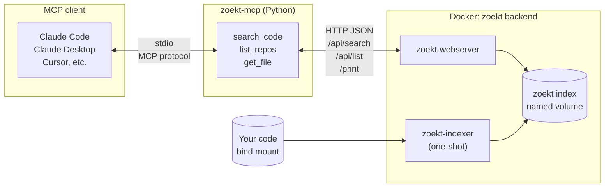
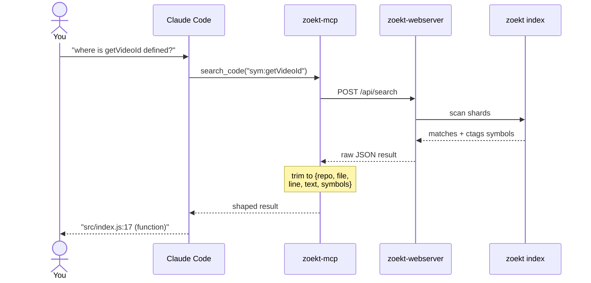
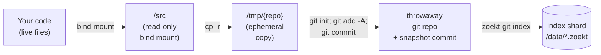

# zoekt-mcp

An [MCP](https://modelcontextprotocol.io) server that exposes
[Sourcegraph Zoekt](https://github.com/sourcegraph/zoekt) code search to any
MCP-capable AI agent — Claude Code, Claude Desktop, Cursor, MCP Inspector,
etc. — so the agent can run fast, indexed, regex/symbol-aware code search
over your repositories regardless of the language you're working in.

- **MCP server:** Python, built on
  [FastMCP](https://github.com/modelcontextprotocol/python-sdk), runs over
  stdio so clients can spawn it as a subprocess.
- **Backend:** a `zoekt-webserver` you bring up via the bundled Docker
  Compose stack (or point the server at any existing zoekt-webserver).
- **Tools exposed:** `search_code`, `list_repos`, `get_file`.

## Architecture



### How a single search flows through the system



## Quickstart

### Prerequisites

- **Docker** — runs the zoekt-webserver backend and the one-shot
  indexer. Any recent Docker Desktop or engine with Compose v2 works.
- **[uv](https://docs.astral.sh/uv/)** must be installed and on your
  `PATH`. MCP clients spawn the Python server via `uvx`, so `which uv`
  needs to resolve in whatever shell your client launches processes in.
  Install it once per machine — any of these works:

  ```bash
  # Official installer (macOS / Linux)
  curl -LsSf https://astral.sh/uv/install.sh | sh

  # Homebrew
  brew install uv

  # pipx (if you already use it)
  pipx install uv
  ```

  The installer drops `uv` and `uvx` into `~/.local/bin/` (Linux/macOS)
  or `%USERPROFILE%\.local\bin\` (Windows). Make sure that directory is
  on your `PATH`; on Ubuntu it usually is by default. Verify with
  `uv --version`.

You do **not** need to create a venv or `pip install` anything to
*use* zoekt-mcp — `uvx` handles that transparently on first invocation.
A venv is only needed if you want to hack on the server itself; see
[Development setup](#development-setup) below.

### 1. Clone this repo

You need a clone for the Docker Compose file and the helper scripts.
The Python server itself runs from the clone via `uvx --from` — no
install step required.

```bash
git clone https://github.com/radiovisual/zoekt-mcp
cd zoekt-mcp
```

### 2. Point the indexer at your code

Tell the backend where your code lives by setting `ZOEKT_REPOS_DIR`
to any parent directory on your machine. **Every top-level
subdirectory of that path becomes one searchable repo in zoekt.**

The easiest way is a one-line `.env` file in `deploy/` — docker
compose picks it up automatically:

```bash
echo "ZOEKT_REPOS_DIR=/home/you/code" > deploy/.env
```

So if your projects directory looks like this:

```text
~/code/
├── project-a/       → indexed as zoekt repo "project-a"
├── project-b/       → indexed as zoekt repo "project-b"
└── scratch-notes/   → indexed as zoekt repo "scratch-notes"
```

…zoekt indexes **all three repos in one pass** and you can scope any
query with `repo:project-a` — or leave `repo:` off to search across
everything at once. See
[Indexing multiple codebases](#indexing-multiple-codebases) below for
more on the one-server-many-repos model.

> On macOS / Windows Docker Desktop, the path you pick must be under
> an allowed file-sharing root (check Docker Desktop → Settings →
> Resources → File Sharing). On Linux there's no such restriction.

### 3. Bring up the backend

```bash
docker compose -f deploy/docker-compose.yml up -d
```

The `zoekt-indexer` one-shot reads everything under `ZOEKT_REPOS_DIR`
and writes shards to a named volume. Then `zoekt-webserver` serves
the HTTP JSON API on `localhost:6070`, reading from the same volume.
See [`deploy/README.md`](deploy/README.md) for details.

Sanity check:

```bash
curl -s -XPOST -d '{"Q":"repo:."}' http://localhost:6070/api/list \
  | python3 -m json.tool | head -20
```

You should see each subdirectory of `ZOEKT_REPOS_DIR` listed as a
zoekt repo.

> **Just want to try it without touching your real code directory?**
> There's a tiny Flask + Express verification corpus under
> `examples/` plus a fixture helper that spins up the stack against
> it:
>
> ```bash
> ./tests/fixtures/up.sh
> ```
>
> See the "Automated tests" section below for details.

### 4. Wire it into your MCP client

`uvx` will build and run the server directly from your clone — no
explicit install step. Point your MCP client at it:

#### Claude Code (`~/.claude.json`)

```json
{
  "mcpServers": {
    "zoekt": {
      "type": "stdio",
      "command": "uvx",
      "args": ["--from", "/absolute/path/to/zoekt-mcp", "zoekt-mcp"],
      "env": { "ZOEKT_URL": "http://localhost:6070" }
    }
  }
}
```

Or with the CLI:

```bash
 claude mcp add zoekt \
    --env ZOEKT_URL=http://localhost:6070 \
    -- uvx --from /absolute/path/to/zoekt-mcp \
    zoekt-mcp
```

#### Claude Desktop (`~/Library/Application Support/Claude/claude_desktop_config.json` on macOS)

```json
{
  "mcpServers": {
    "zoekt": {
      "command": "uvx",
      "args": ["--from", "/absolute/path/to/zoekt-mcp", "zoekt-mcp"],
      "env": { "ZOEKT_URL": "http://localhost:6070" }
    }
  }
}
```

Restart the client and the three tools (`search_code`, `list_repos`,
`get_file`) should appear.

> Once zoekt-mcp is published to PyPI, the `--from` argument goes
> away and the config collapses to `"args": ["zoekt-mcp"]` — no
> clone required for the Python side. The backend still needs the
> compose file from this repo.

## Indexing multiple codebases

**One zoekt-mcp server handles as many repos as you want** — that's
the default. Every top-level subdirectory of `ZOEKT_REPOS_DIR` becomes
a separate searchable repo in one shared index. The `search_code`
tool can scope to a subset with `repo:NAME` (regex matched against
repo names) or leave `repo:` off to search across everything.

If your projects live under different parent directories (e.g.
`~/work/` and `~/personal/`), the simplest fix is to create a single
"index root" directory with symlinks pointing at each project and set
`ZOEKT_REPOS_DIR` to that index root. One server, one config, all
repos searchable.

```bash
mkdir -p ~/.zoekt-root
ln -s ~/work/project-a       ~/.zoekt-root/project-a
ln -s ~/personal/side-thing  ~/.zoekt-root/side-thing
echo "ZOEKT_REPOS_DIR=$HOME/.zoekt-root" > deploy/.env
docker compose -f deploy/docker-compose.yml up -d
```

> Docker has to follow the symlinks when it resolves the bind mount,
> which works on Linux but is hit-or-miss on Docker Desktop. If the
> linked directories don't show up inside the container, fall back
> to putting real directories (or clones) under `~/.zoekt-root`
> instead of symlinks.

### When you actually need two servers

A second zoekt-mcp instance is only worth the setup cost when you
want **fully isolated index pools** — for example, keeping work code
and personal code in completely separate search namespaces, or
running two different backends (e.g. different zoekt versions) side
by side. It is **not** needed just to index more code; one server
with many subdirectories is the right tool for that.

If you genuinely want two instances:

1. Copy `deploy/docker-compose.yml` to a second file, e.g.
   `deploy/docker-compose.personal.yml`.
2. In the copy, change:
   - the compose project `name:` (e.g. `zoekt-mcp-personal`)
   - the host port mapping (e.g. `6071:6070`)
   - the named volume (e.g. `zoekt-mcp-personal-index`)
   - the container names (e.g. `zoekt-mcp-personal-webserver`)
3. Give the second stack its own env file, e.g.
   `deploy/.env.personal`, pointing `ZOEKT_REPOS_DIR` at a different
   directory.
4. Bring each stack up with its own compose file and env file:

   ```bash
   docker compose -f deploy/docker-compose.yml up -d
   docker compose -f deploy/docker-compose.personal.yml \
     --env-file deploy/.env.personal up -d
   ```

5. Wire both into Claude Code as distinct MCP servers — they can
   point at the same `zoekt-mcp` clone, just with different
   `ZOEKT_URL` values:

   ```json
   {
     "mcpServers": {
       "zoekt-work": {
         "command": "uvx",
         "args": ["--from", "/absolute/path/to/zoekt-mcp", "zoekt-mcp"],
         "env": { "ZOEKT_URL": "http://localhost:6070" }
       },
       "zoekt-personal": {
         "command": "uvx",
         "args": ["--from", "/absolute/path/to/zoekt-mcp", "zoekt-mcp"],
         "env": { "ZOEKT_URL": "http://localhost:6071" }
       }
     }
   }
   ```

Claude Code sees two independent sets of tools (`search_code` /
`list_repos` / `get_file` from each namespace) and decides which to
call based on the question.

For most users, **one server with a well-populated `ZOEKT_REPOS_DIR`
is all you need.** Don't reach for multi-server unless you have a
concrete reason to isolate.

### Advanced: staging code under `deploy/repos/`

As an alternative to pointing `ZOEKT_REPOS_DIR` at your real code,
you can drop clones or directories directly into `deploy/repos/`
(gitignored) and leave the default mount path alone:

```bash
mkdir -p deploy/repos
git clone https://github.com/myorg/myrepo deploy/repos/myrepo
docker compose -f deploy/docker-compose.yml up -d
```

This is useful when you can't expose your real code directory to
Docker (e.g. corporate file-sharing restrictions on Docker Desktop),
or for one-off experiments with a repo you don't have locally.

The trade-off is a **freshness trap**: you now have two copies of
every project — the one you actually edit, and the copy under
`deploy/repos/`. Re-running the indexer re-reads the stale copy, so
you'd need to `git pull` (or `cp -r` your edits) inside
`deploy/repos/myrepo/` before each re-index. Prefer the main
`ZOEKT_REPOS_DIR` workflow unless you have a specific reason not to.

## Tool surface

| Tool | Parameters | Returns |
|------|------------|---------|
| `search_code` | `query: str`, `max_results: int = 50`, `context_lines: int = 3` | `{query, file_count, match_count, duration_ns, files: [{repo, file, language, branches, matches: [{line, text, ranges, symbols}]}]}` |
| `list_repos` | `filter: str = ""` (optional `repo:` atom) | `{count, repos: [{name, url, branches, index_time}]}` |
| `get_file` | `repo: str`, `path: str`, `branch: str = "HEAD"` | `{repo, path, branch, content}` |

### Query language

Zoekt's query DSL ([full reference](https://github.com/sourcegraph/zoekt/blob/main/doc/query_syntax.md)):

| Atom | Example | Meaning |
|------|---------|---------|
| `repo:` | `repo:flask-app` | Restrict to repos whose name matches (regex) |
| `file:` | `file:app.py` | Restrict to file paths matching |
| `lang:` | `lang:python` | Restrict to a language |
| `sym:` | `sym:list_users` | Match symbol definitions |
| `case:yes` | `case:yes Foo` | Case-sensitive content match |
| `/regex/` | `/users?/` | Regex content match |
| (whitespace) | `lang:go func main` | Boolean AND |
| `or` | `def hello or function hello` | Boolean OR |

## Keeping the index fresh

Zoekt searches a **pre-built index**, not your files directly. When
you edit code, the index doesn't auto-update — your next search can
return stale line numbers, miss newly-added symbols, or point Claude
at functions that have moved or been renamed. Stale search is the
main thing that burns tokens, because Claude falls back to reading
whole files with `get_file` when `search_code` returns nothing useful.

Here's what happens every time the indexer runs:



The copy to `/tmp/` is ephemeral — it happens fresh on every indexer
run and never touches your real files. Each refresh always reads
whatever is currently in the mounted source directory.

Fortunately, re-indexing is fast (seconds, even for large repos),
runs entirely in Docker, involves no LLM calls, and costs zero
tokens. You just need to decide **how** you want to trigger it.

Because the main quickstart already points `ZOEKT_REPOS_DIR` at your
live code directory, every re-index automatically reflects your
latest edits — no copy step to keep in sync. (If you're on the
[advanced staging workflow](#advanced-staging-code-under-deployrepos)
instead, update the clones under `deploy/repos/` before you trigger
a re-index, otherwise zoekt just re-reads the stale copies.)

### Recipes for triggering the re-index

All four recipes run out-of-band — no Claude, no tokens, no context
window involvement. Pick whichever matches how you work.

#### 1. Manual re-index

Run [`deploy/index.sh`](deploy/index.sh) whenever you know you've
made significant changes. The script runs just the indexer container
against the current `ZOEKT_REPOS_DIR` without bouncing the webserver,
so search stays available throughout.

```bash
./deploy/index.sh
```

*Good when:* you only use Claude for occasional sessions and don't
mind typing one command before you start. Zero background cost.

#### 2. Cron (scheduled re-index)

Background re-index on a schedule. No manual step, slightly stale
between ticks.

```cron
# Re-index every 15 minutes
*/15 * * * * cd /path/to/your/project/zoekt-mcp && ./deploy/index.sh >/dev/null 2>&1
```

*Good when:* you work on code most days and want fresh-ish search
any time you open Claude. Once an hour is fine for most users.

#### 3. Filesystem watcher

React to file changes in near-real-time via `inotifywait` (Linux)
or `fswatch` (macOS). Catches every edit, idle otherwise.

```bash
# Linux: one-liner, run it in a tmux pane or as a systemd --user service
while inotifywait -r -e modify,create,delete,move \
    --exclude '\.git/|node_modules/|__pycache__/' \
    /path/to/your/project 2>/dev/null; do
  ./deploy/index.sh
done
```

```bash
# macOS equivalent with fswatch (brew install fswatch)
fswatch -o /Users/you/code | xargs -n1 -I{} ./deploy/index.sh
```

*Good when:* you want "search is always current, no matter when I
ask." Caveat: on projects with noisy tooling (compilers writing to
build dirs, IDE lockfiles), the excludes list is important — without
them you'll re-index constantly.

#### 4. Claude Code SessionStart hook

Re-index every time you launch a new Claude Code session, so the
first search of every session is guaranteed fresh. This is probably
the best default for most users: no background process, no cron
entry, and freshness is tied exactly to when you'd actually notice
staleness.

```json
// ~/.claude.json
{
  "hooks": {
    "SessionStart": [
      {
        "command": "/path/to/your/project/zoekt-mcp/deploy/index.sh"
      }
    ]
  }
}
```

*Good when:* you want zero ongoing processes and guaranteed fresh
search at the moment you actually use Claude. The session start is
blocked on the re-index, but that's a few seconds at most.

### Which one should I pick?

| If you… | Use |
|---------|-----|
| …occasionally fire up Claude and don't mind a manual step | **Recipe 1** (manual) |
| …want "set it and forget it" but tolerate N-minute staleness | **Recipe 2** (cron) |
| …want always-fresh search and can tune the exclude list | **Recipe 3** (watcher) |
| …mostly interact with code via Claude Code sessions | **Recipe 4** (SessionStart hook) |

None of these recipes are exclusive — e.g. running cron *and* the
SessionStart hook is fine if you want both ambient freshness and a
guarantee at session start.

## Manual testing with MCP Inspector

```bash
npx @modelcontextprotocol/inspector uvx --from . zoekt-mcp
```

The Inspector opens a browser UI on `http://localhost:6274`. Under **Tools**
→ **search_code**, try:

- `lang:python def hello` — expect a match in `flask-app/app.py`
- `lang:javascript USERS` — expect a match in `express-app/index.js`
- `sym:users` — expect matches in **both** examples

Under **Tools → list_repos**, an empty filter should return both
`flask-app` and `express-app`.

## Development setup

If you want to hack on the server itself (rather than just use it via
`uvx`), clone the repo and let `uv` manage the venv for you:

```bash
git clone https://github.com/radiovisual/zoekt-mcp
cd zoekt-mcp
uv sync
```

`uv sync` creates `.venv/`, resolves everything against `uv.lock`, and
installs all runtime + dev dependencies. The dev group (`pytest`,
`pytest-asyncio`, `respx`) is installed by default; pass
`uv sync --no-dev` for a runtime-only install.

Common dev commands:

```bash
uv run pytest                    # run the full test suite
uv run zoekt-mcp --help          # run the CLI from source
uv add <package>                 # add a new runtime dep
uv add --dev <package>           # add a new dev dep
uv lock --upgrade                # refresh uv.lock
```

### Linting

Markdown is linted with
[pymarkdownlnt](https://github.com/jackdewinter/pymarkdown), configured
under `[tool.pymarkdown]` in [`pyproject.toml`](pyproject.toml). Run
the linter against every project-owned markdown file with:

```bash
uv run pymarkdown scan README.md deploy/README.md examples/*/README.md
```

The linting step must pass before committing documentation changes.
To check a single file while iterating:

```bash
uv run pymarkdown scan README.md
```

Most default rules are enabled; we disable `MD013` (line length) and
`MD046` (code block style) because they fight readable prose and
tables full of long URLs. Tweak the configuration in `pyproject.toml`
if you need to relax or re-enable other rules.

## Automated tests

```bash
# Unit tests (no Docker required)
uv run pytest tests/test_client_unit.py tests/test_server_shaping.py -v

# Integration tests: bring the stack up against the examples/ corpus,
# then run the live assertions.
./tests/fixtures/up.sh
uv run pytest tests/test_integration.py -v
./tests/fixtures/down.sh
```

`tests/fixtures/up.sh` sets `ZOEKT_REPOS_DIR=../examples` and invokes
the same `deploy/docker-compose.yml`, so the test fixtures don't leak
into the production deploy path. The integration tests skip
automatically when `ZOEKT_URL` is unreachable, so a plain
`uv run pytest` in a fresh checkout without Docker still passes.

## Configuration

| Setting | Env var | Flag | Default |
|---------|---------|------|---------|
| Zoekt backend URL | `ZOEKT_URL` | `--backend` | `http://localhost:6070` |
| HTTP timeout (s) | `ZOEKT_TIMEOUT` | `--timeout` | `30` |

## Repo layout

```text
zoekt-mcp/
├── src/zoekt_mcp/         # the Python MCP server
├── tests/
│   ├── test_client_unit.py     # offline unit tests
│   ├── test_integration.py     # live tests (skip when backend down)
│   └── fixtures/               # test-only helpers (up.sh / down.sh)
├── deploy/
│   ├── docker-compose.yml      # generic zoekt backend (env-driven)
│   └── repos/                  # user-populated source mount (gitignored)
└── examples/
    ├── flask-app/              # Flask verification corpus
    └── express-app/            # Express verification corpus
```

## Troubleshooting

Common indexing pitfalls, in Q&A form. Click any question to expand
the answer.

<details>
<summary><b>Q: <code>search_code</code> returns 0 hits for a string I know is in my project. What's wrong?</b></summary>

Nine times out of ten the index doesn't actually contain your code —
zoekt is searching a different (or stale) corpus. The MCP server
itself doesn't filter or rewrite queries; whatever you send goes
straight to `/api/search`, so 0 hits means 0 hits *in the index*.

Diagnose it in three steps:

1. Ask the agent to call `list_repos` (or `curl -s -XPOST -d '{"Q":"repo:."}' http://localhost:6070/api/list`). This is the source of truth for what zoekt can see.
2. If your project isn't in the list, the indexer was pointed somewhere else. Common culprits:
   - Someone ran `./tests/fixtures/up.sh`, which sets `ZOEKT_REPOS_DIR=../examples` and indexes only `examples/express-app` and `examples/flask-app`.
   - `deploy/.env` is missing or has the wrong `ZOEKT_REPOS_DIR`, so `docker compose up` fell back to the empty `deploy/repos/` and either failed or indexed leftover content from a previous run.
   - The indexer wipes `/data/*` on every run (see `deploy/docker-compose.yml`), so a previous good run does **not** persist alongside a later one — the most recent indexer invocation is the only thing the webserver can see.
3. Re-run the indexer against the right directory:

    ```bash
    ZOEKT_REPOS_DIR=/absolute/path/to/parent-of-your-repo \
      docker compose -f deploy/docker-compose.yml up -d --force-recreate zoekt-indexer
    ```

    `ZOEKT_REPOS_DIR` must be a **parent** directory; every top-level subdirectory under it becomes one repo. Re-run `list_repos` after the indexer exits to confirm.

</details>

<details>
<summary><b>Q: The indexer exits with <code>WARNING: no repositories were indexed</code>. Now what?</b></summary>

The directory pointed at by `ZOEKT_REPOS_DIR` (or `deploy/repos/` by
default) has no top-level subdirectories the indexer could turn into
repos. Either:

- Drop at least one directory (or `git clone`) into `deploy/repos/`, or
- Set `ZOEKT_REPOS_DIR` to a parent that already contains your project subdirectories, e.g. `echo "ZOEKT_REPOS_DIR=$HOME/code" > deploy/.env`, then `docker compose -f deploy/docker-compose.yml up -d`.

Loose files at the top of `ZOEKT_REPOS_DIR` are ignored — the loop
in the compose file only iterates over directories.

</details>

<details>
<summary><b>Q: <code>list_repos</code> shows <code>express-app</code> and <code>flask-app</code> but not my code.</b></summary>

Those are the in-repo verification fixtures under `examples/`. They
end up in your index when something — usually `tests/fixtures/up.sh`
— ran the indexer with `ZOEKT_REPOS_DIR=../examples`. Re-index
against your real project directory (see the first Q&A above) and
they'll be replaced; the indexer wipes `/data/` at the start of every
run, so there's no need to clean up separately.

</details>

<details>
<summary><b>Q: I edited a file but search results still show the old content / line numbers.</b></summary>

The index is a snapshot, not a live view. zoekt only sees what was
in `ZOEKT_REPOS_DIR` the last time the indexer ran. Trigger a refresh
with `./deploy/index.sh`, or set up one of the four automation
recipes in [Keeping the index fresh](#keeping-the-index-fresh) so it
happens on its own. Re-indexing is fast (seconds, even for large
repos) and runs entirely in Docker — no LLM calls, zero token cost.

</details>

<details>
<summary><b>Q: <code>POST /api/search</code> returns HTML instead of JSON.</b></summary>

The webserver was started without `-rpc`, so `/api/*` falls through
to the HTML search handler. The bundled `deploy/docker-compose.yml`
already passes `-rpc` (see the `command:` block under
`zoekt-webserver`); if you're running your own zoekt-webserver
elsewhere, add `-rpc` to its argv and restart.

</details>

## License

MIT — see [`LICENSE`](LICENSE).
