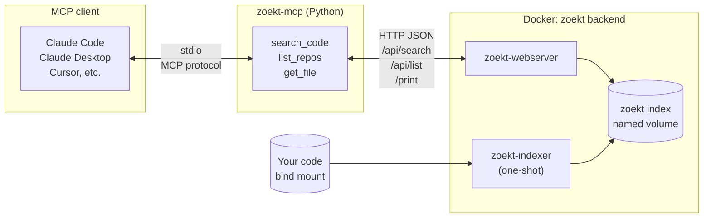
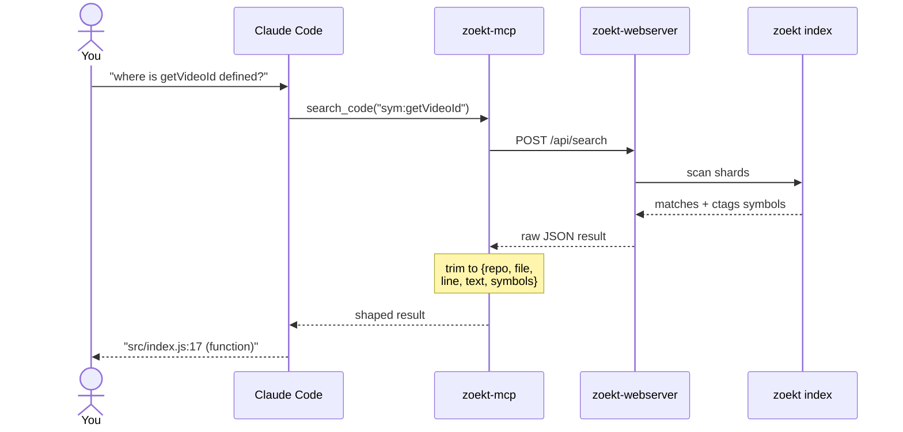
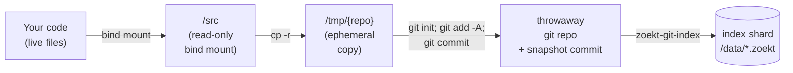

# zoekt-mcp

An [MCP](https://modelcontextprotocol.io) server that exposes
[Sourcegraph Zoekt](https://github.com/sourcegraph/zoekt) code search to any
MCP-capable AI agent — Claude Code, Claude Desktop, Cursor, MCP Inspector,
etc. — so the agent can run fast, indexed, regex/symbol-aware code search
over your repositories regardless of the language you're working in.

- **MCP server:** Python, built on
  [FastMCP](https://github.com/modelcontextprotocol/python-sdk), runs over
  stdio so clients can spawn it as a subprocess.
- **Backend:** a `zoekt-webserver` you bring up via the bundled Docker
  Compose stack (or point the server at any existing zoekt-webserver).
- **Tools exposed:** `search_code`, `list_repos`, `get_file`.

## Architecture



### How a single search flows through the system



## Quickstart

### Prerequisites

- **Docker** — runs the zoekt-webserver backend and the one-shot
  indexer. Any recent Docker Desktop or engine with Compose v2 works.
- **[uv](https://docs.astral.sh/uv/)** must be installed and on your
  `PATH`. MCP clients spawn the Python server via `uvx`, so `which uv`
  needs to resolve in whatever shell your client launches processes in.
  Install it once per machine — any of these works:

  ```bash
  # Official installer (macOS / Linux)
  curl -LsSf https://astral.sh/uv/install.sh | sh

  # Homebrew
  brew install uv

  # pipx (if you already use it)
  pipx install uv
  ```

  The installer drops `uv` and `uvx` into `~/.local/bin/` (Linux/macOS)
  or `%USERPROFILE%\.local\bin\` (Windows). Make sure that directory is
  on your `PATH`; on Ubuntu it usually is by default. Verify with
  `uv --version`.

You do **not** need to create a venv or `pip install` anything to
*use* zoekt-mcp — `uvx` handles that transparently on first invocation.
A venv is only needed if you want to hack on the server itself; see
[Development setup](#development-setup) below.

### 1. Clone and bring up the backend

You need a clone of this repo for the Docker Compose file and for a
directory to drop indexable code into.

```bash
git clone https://github.com/wuergler/zoekt-mcp
cd zoekt-mcp
```

Drop any git clones or source directories you want searchable into
`deploy/repos/` (gitignored). Each top-level subdirectory becomes one
zoekt repo.

```bash
mkdir -p deploy/repos
git clone https://github.com/myorg/myrepo deploy/repos/myrepo

docker compose -f deploy/docker-compose.yml up -d
```

The `zoekt-indexer` one-shot indexes everything under `deploy/repos/`
into a named volume, then `zoekt-webserver` serves the HTTP JSON API
on port `6070`. See [`deploy/README.md`](deploy/README.md) for details.

Sanity check:

```bash
curl -s http://localhost:6070/healthz                                        # -> "OK"
curl -s -XPOST -d '{"Q":"repo:myrepo func"}' http://localhost:6070/api/search | head -c 400
```

> **Just want to see it work without populating `deploy/repos/`?**
> There's a tiny Flask + Express verification corpus under
> `examples/` plus a fixture helper that points the backend at it:
>
> ```bash
> ./tests/fixtures/up.sh
> ```
>
> See the "Automated tests" section below for details.

### 2. Wire it into your MCP client

`uvx` will build and run the server directly from your clone — no
explicit install step. Point your MCP client at it:

#### Claude Code (`~/.claude.json`)

```json
{
  "mcpServers": {
    "zoekt": {
      "type": "stdio",
      "command": "uvx",
      "args": ["--from", "/absolute/path/to/zoekt-mcp", "zoekt-mcp"],
      "env": { "ZOEKT_URL": "http://localhost:6070" }
    }
  }
}
```

Or with the CLI:

```bash
claude mcp add zoekt uvx --from /absolute/path/to/zoekt-mcp zoekt-mcp
```

#### Claude Desktop (`~/Library/Application Support/Claude/claude_desktop_config.json` on macOS)

```json
{
  "mcpServers": {
    "zoekt": {
      "command": "uvx",
      "args": ["--from", "/absolute/path/to/zoekt-mcp", "zoekt-mcp"],
      "env": { "ZOEKT_URL": "http://localhost:6070" }
    }
  }
}
```

Restart the client and the three tools (`search_code`, `list_repos`,
`get_file`) should appear.

> Once zoekt-mcp is published to PyPI, the `--from` argument goes
> away and the config collapses to `"args": ["zoekt-mcp"]` — no
> clone required for the Python side. The backend still needs the
> compose file from this repo.

## Tool surface

| Tool | Parameters | Returns |
|------|------------|---------|
| `search_code` | `query: str`, `max_results: int = 50`, `context_lines: int = 3` | `{query, file_count, match_count, duration_ns, files: [{repo, file, language, branches, matches: [{line, text, ranges, symbols}]}]}` |
| `list_repos` | `filter: str = ""` (optional `repo:` atom) | `{count, repos: [{name, url, branches, index_time}]}` |
| `get_file` | `repo: str`, `path: str`, `branch: str = "HEAD"` | `{repo, path, branch, content}` |

### Query language

Zoekt's query DSL ([full reference](https://github.com/sourcegraph/zoekt/blob/main/doc/query_syntax.md)):

| Atom | Example | Meaning |
|------|---------|---------|
| `repo:` | `repo:flask-app` | Restrict to repos whose name matches (regex) |
| `file:` | `file:app.py` | Restrict to file paths matching |
| `lang:` | `lang:python` | Restrict to a language |
| `sym:` | `sym:list_users` | Match symbol definitions |
| `case:yes` | `case:yes Foo` | Case-sensitive content match |
| `/regex/` | `/users?/` | Regex content match |
| (whitespace) | `lang:go func main` | Boolean AND |
| `or` | `def hello or function hello` | Boolean OR |

## Keeping the index fresh

Zoekt searches a **pre-built index**, not your files directly. When
you edit code, the index doesn't auto-update — your next search can
return stale line numbers, miss newly-added symbols, or point Claude
at functions that have moved or been renamed. Stale search is the
main thing that burns tokens, because Claude falls back to reading
whole files with `get_file` when `search_code` returns nothing useful.

Here's what happens every time the indexer runs:



The copy to `/tmp/` is ephemeral — it happens fresh on every indexer
run and never touches your real files. Each refresh always reads
whatever is currently in the mounted source directory.

Fortunately, re-indexing is fast (seconds, even for large repos),
runs entirely in Docker, involves no LLM calls, and costs zero
tokens. You just need to decide **how** you want to trigger it.

### Step zero: point the indexer at your real code

If you've been dropping clones into `deploy/repos/`, you've got two
copies of each project: the one you actually edit, and the one zoekt
sees. That's a freshness trap — even re-running the indexer re-reads
the stale copy.

The compose file reads `ZOEKT_REPOS_DIR` as an env var, so you can
point it at your real projects directory instead:

```bash
# Linux/macOS: every subdir of ~/code becomes one searchable repo
echo "ZOEKT_REPOS_DIR=/home/you/code" > deploy/.env

docker compose -f deploy/docker-compose.yml down -v   # clear old index
docker compose -f deploy/docker-compose.yml up -d     # re-index from ~/code
```

Now re-indexing reflects your actual edits instead of a stale copy.

> On macOS / Windows Docker Desktop, the path you pick must be under
> an allowed file-sharing root (check Docker Desktop → Settings →
> Resources → File Sharing). On Linux there's no such restriction.

### Recipes for triggering the re-index

All four recipes run out-of-band — no Claude, no tokens, no context
window involvement. Pick whichever matches how you work.

#### 1. Manual re-index

Run [`deploy/index.sh`](deploy/index.sh) whenever you know you've
made significant changes. The script runs just the indexer container
against the current `ZOEKT_REPOS_DIR` without bouncing the webserver,
so search stays available throughout.

```bash
./deploy/index.sh
```

*Good when:* you only use Claude for occasional sessions and don't
mind typing one command before you start. Zero background cost.

#### 2. Cron (scheduled re-index)

Background re-index on a schedule. No manual step, slightly stale
between ticks.

```cron
# Re-index every 15 minutes
*/15 * * * * cd /path/to/your/project/zoekt-mcp && ./deploy/index.sh >/dev/null 2>&1
```

*Good when:* you work on code most days and want fresh-ish search
any time you open Claude. Once an hour is fine for most users.

#### 3. Filesystem watcher

React to file changes in near-real-time via `inotifywait` (Linux)
or `fswatch` (macOS). Catches every edit, idle otherwise.

```bash
# Linux: one-liner, run it in a tmux pane or as a systemd --user service
while inotifywait -r -e modify,create,delete,move \
    --exclude '\.git/|node_modules/|__pycache__/' \
    /path/to/your/project 2>/dev/null; do
  ./deploy/index.sh
done
```

```bash
# macOS equivalent with fswatch (brew install fswatch)
fswatch -o /Users/you/code | xargs -n1 -I{} ./deploy/index.sh
```

*Good when:* you want "search is always current, no matter when I
ask." Caveat: on projects with noisy tooling (compilers writing to
build dirs, IDE lockfiles), the excludes list is important — without
them you'll re-index constantly.

#### 4. Claude Code SessionStart hook

Re-index every time you launch a new Claude Code session, so the
first search of every session is guaranteed fresh. This is probably
the best default for most users: no background process, no cron
entry, and freshness is tied exactly to when you'd actually notice
staleness.

```json
// ~/.claude.json
{
  "hooks": {
    "SessionStart": [
      {
        "command": "/path/to/your/project/zoekt-mcp/deploy/index.sh"
      }
    ]
  }
}
```

*Good when:* you want zero ongoing processes and guaranteed fresh
search at the moment you actually use Claude. The session start is
blocked on the re-index, but that's a few seconds at most.

### Which one should I pick?

| If you… | Use |
|---------|-----|
| …occasionally fire up Claude and don't mind a manual step | **Recipe 1** (manual) |
| …want "set it and forget it" but tolerate N-minute staleness | **Recipe 2** (cron) |
| …want always-fresh search and can tune the exclude list | **Recipe 3** (watcher) |
| …mostly interact with code via Claude Code sessions | **Recipe 4** (SessionStart hook) |

None of these recipes are exclusive — e.g. running cron *and* the
SessionStart hook is fine if you want both ambient freshness and a
guarantee at session start.

## Manual testing with MCP Inspector

```bash
npx @modelcontextprotocol/inspector uvx --from . zoekt-mcp
```

The Inspector opens a browser UI on `http://localhost:6274`. Under **Tools**
→ **search_code**, try:

- `lang:python def hello` — expect a match in `flask-app/app.py`
- `lang:javascript USERS` — expect a match in `express-app/index.js`
- `sym:users` — expect matches in **both** examples

Under **Tools → list_repos**, an empty filter should return both
`flask-app` and `express-app`.

## Development setup

If you want to hack on the server itself (rather than just use it via
`uvx`), clone the repo and let `uv` manage the venv for you:

```bash
git clone https://github.com/radiovisual/zoekt-mcp
cd zoekt-mcp
uv sync
```

`uv sync` creates `.venv/`, resolves everything against `uv.lock`, and
installs all runtime + dev dependencies. The dev group (`pytest`,
`pytest-asyncio`, `respx`) is installed by default; pass
`uv sync --no-dev` for a runtime-only install.

Common dev commands:

```bash
uv run pytest                    # run the full test suite
uv run zoekt-mcp --help          # run the CLI from source
uv add <package>                 # add a new runtime dep
uv add --dev <package>           # add a new dev dep
uv lock --upgrade                # refresh uv.lock
```

## Automated tests

```bash
# Unit tests (no Docker required)
uv run pytest tests/test_client_unit.py tests/test_server_shaping.py -v

# Integration tests: bring the stack up against the examples/ corpus,
# then run the live assertions.
./tests/fixtures/up.sh
uv run pytest tests/test_integration.py -v
./tests/fixtures/down.sh
```

`tests/fixtures/up.sh` sets `ZOEKT_REPOS_DIR=../examples` and invokes
the same `deploy/docker-compose.yml`, so the test fixtures don't leak
into the production deploy path. The integration tests skip
automatically when `ZOEKT_URL` is unreachable, so a plain
`uv run pytest` in a fresh checkout without Docker still passes.

## Configuration

| Setting | Env var | Flag | Default |
|---------|---------|------|---------|
| Zoekt backend URL | `ZOEKT_URL` | `--backend` | `http://localhost:6070` |
| HTTP timeout (s) | `ZOEKT_TIMEOUT` | `--timeout` | `30` |

## Repo layout

```text
zoekt-mcp/
├── src/zoekt_mcp/         # the Python MCP server
├── tests/
│   ├── test_client_unit.py     # offline unit tests
│   ├── test_integration.py     # live tests (skip when backend down)
│   └── fixtures/               # test-only helpers (up.sh / down.sh)
├── deploy/
│   ├── docker-compose.yml      # generic zoekt backend (env-driven)
│   └── repos/                  # user-populated source mount (gitignored)
└── examples/
    ├── flask-app/              # Flask verification corpus
    └── express-app/            # Express verification corpus
```

## License

MIT — see [`LICENSE`](LICENSE).
